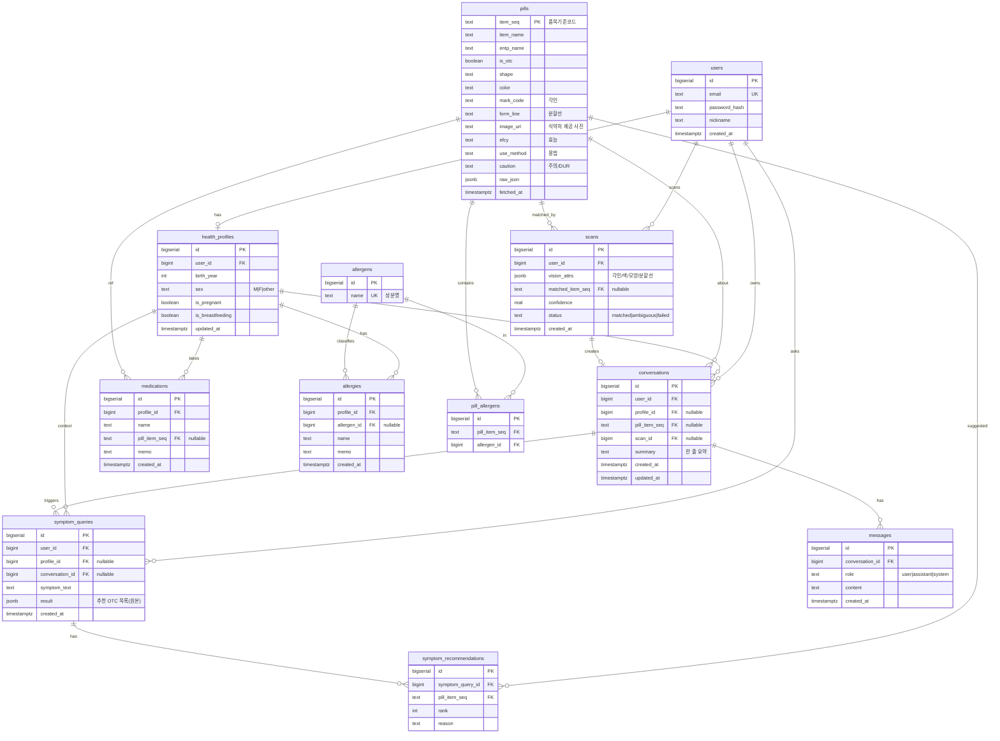

# pill_recognition — ERD (데이터 모델)

> 데이터 모델의 단일 출처. 목표/결정 맥락은 [PLAN.md](../PLAN.md), 문서 규칙은 [CONVENTIONS.md](../CONVENTIONS.md).
> **상태**: v1.2 (2026-06-19) · 대상 DB **PostgreSQL**.
> **v1.2 변경**: 기능 연결 5개 반영. ①알레르기↔약: 성분 마스터 `allergens` + `pill_allergens`(약↔성분 M:N) 신설, `allergies`가 `allergen_id`로 성분 참조 → "못 먹는 약" 판정. ②약↔증상추천: `symptom_recommendations`(증상추천↔약 M:N) 신설. ③증상추천↔대화세션: `symptom_queries.conversation_id`. ④증상추천↔건강정보: `symptom_queries.profile_id`. ⑤건강정보↔대화세션: `conversations.profile_id`. 테이블 9 → **12개**.
> **v1.1 변경**: `summaries`(버전 누적 요약) 테이블 제거 → `conversations.summary`(한 줄 요약)로 흡수. `conversations.title` 제거(요약으로 목록 표시 통일). `conversations`를 "대화 세션"(클로드 채팅처럼 세션 단위로 저장)으로 정리. 테이블 10 → 9개.
> **단, 프로토타입 단계에선 서버/DB를 실제 구현하지 않는다** — 프론트 임시 저장(localStorage 등)으로 진행하고, 추후 백엔드 영속화 시 이 스키마대로 구현한다.

## 결정 요약

- **계정**: `users`(이메일+비밀번호) 스키마는 둔다. **프로토타입에선 인증 미구현** — 시드 dev 유저 1명에 모든 row를 연결. 로그인은 나중에 얹는다.
- **건강정보**: 목표 스키마는 서버 DB(`health_profiles`/`medications`/`allergies`). 프로토타입은 위 방침대로 임시 저장. (PLAN 초기안의 localStorage → 서버 DB로 방향 확정, 단 구현은 추후)
- **촬영 이미지**: **서버에 저장하지 않는다.** 비전 LLM이 추출한 속성(`scans.vision_attrs`)만 보관. (`pills.image_url`은 식약처가 제공하는 약 사진으로, 우리 촬영본과 무관.)
- **약 데이터**: 식약처 3종 API(낱알식별·DUR·e약은요) 결과를 `pills`에 품목코드(`item_seq`) 기준으로 캐시.
- **대화 세션**: `conversations` = 약 1건에 대한 **대화 세션**(클로드 채팅의 한 대화방). 인식 성공 시 자동 생성(`scan_id`). 세션 목록의 진입 버튼엔 제목 대신 **`summary`(한 줄 요약) + `updated_at`** 을 띄운다. 주고받은 말풍선은 `messages`(세션 1:N).
- **알레르기 매칭**: 알레르기 유발 성분을 마스터 `allergens`로 정규화. 사용자 알레르기(`allergies.allergen_id`)와 약 성분(`pill_allergens`)이 같은 성분을 가리켜, "사용자 알레르기 ∩ 약 성분 ≠ ∅" 이면 **못 먹는 약**으로 판정. 자유 입력으로 마스터에 없으면 `allergen_id`는 null 허용.
- **증상별 추천**: `symptom_queries`는 대화 세션에서 말한 증상(`conversation_id`)과 사용자 건강정보(`profile_id`)를 입력으로 추천. 추천된 약은 `symptom_recommendations`로 `pills`에 정규화 연결(원본 `result` jsonb는 보관용 유지).

## 다이어그램



## 테이블 정의 (DDL 스타일)

```sql
users
  id            bigserial PK
  email         text UNIQUE NOT NULL
  password_hash text NOT NULL            -- 프로토타입: 미사용(시드 dev 유저)
  nickname      text
  created_at    timestamptz DEFAULT now()

health_profiles                          -- users 1:1
  id               bigserial PK
  user_id          bigint FK->users UNIQUE NOT NULL
  birth_year       int
  sex              text                  -- 'M' | 'F' | 'other'
  is_pregnant      boolean DEFAULT false
  is_breastfeeding boolean DEFAULT false
  updated_at       timestamptz DEFAULT now()

medications                              -- health_profiles 1:N (복용약)
  id            bigserial PK
  profile_id    bigint FK->health_profiles NOT NULL
  name          text NOT NULL
  pill_item_seq text FK?->pills          -- 식별되면 연결
  memo          text
  created_at    timestamptz DEFAULT now()

allergies                                -- health_profiles 1:N (사용자 알레르기)
  id          bigserial PK
  profile_id  bigint FK->health_profiles NOT NULL
  allergen_id bigint FK?->allergens       -- 성분 마스터 매칭(자유입력 미매칭 시 null)
  name        text NOT NULL              -- 사용자가 입력한 원문(표시용)
  memo        text
  created_at  timestamptz DEFAULT now()

allergens                                -- 알레르기 유발 성분 마스터
  id   bigserial PK
  name text UNIQUE NOT NULL              -- 성분명 (예: 페니실린, 아스피린)

pill_allergens                           -- pills M:N allergens (약이 포함하는 성분)
  id            bigserial PK
  pill_item_seq text FK->pills NOT NULL
  allergen_id   bigint FK->allergens NOT NULL
  -- UNIQUE(pill_item_seq, allergen_id)

pills                                    -- 식약처 3종 API 캐시
  item_seq    text PK                    -- 품목기준코드
  item_name   text NOT NULL
  entp_name   text                       -- 업체
  is_otc      boolean                    -- OTC/ETC
  shape       text
  color       text
  mark_code   text                       -- 각인
  form_line   text                       -- 분할선
  image_url   text                       -- 식약처 제공 약 사진(우리 촬영본 아님)
  efcy        text                       -- e약은요 효능
  use_method  text                       -- 용법
  caution     text                       -- 주의(DUR 포함)
  raw_json    jsonb
  fetched_at  timestamptz DEFAULT now()

scans                                    -- 인식 (촬영본 미저장)
  id               bigserial PK
  user_id          bigint FK->users NOT NULL
  vision_attrs     jsonb                 -- 비전 LLM 추출(mark_code/color/shape/form_line)
  matched_item_seq text FK?->pills
  confidence       real                  -- 0~1 매칭 신뢰도
  status           text                  -- 'matched' | 'ambiguous' | 'failed'
  created_at       timestamptz DEFAULT now()

conversations                            -- 대화 세션 (약 1건당 N개 가능)
  id            bigserial PK
  user_id       bigint FK->users NOT NULL
  profile_id    bigint FK?->health_profiles -- 대화 시 참고한 건강정보
  pill_item_seq text FK?->pills
  scan_id       bigint FK?->scans        -- 인식에서 자동 생성 시
  summary       text                     -- 한 줄 요약 (목록에 표시)
  created_at    timestamptz DEFAULT now()
  updated_at    timestamptz DEFAULT now()

messages                                 -- conversations 1:N (세션 안 말풍선)
  id              bigserial PK
  conversation_id bigint FK->conversations NOT NULL
  role            text NOT NULL          -- 'user' | 'assistant' | 'system'
  content         text NOT NULL
  created_at      timestamptz DEFAULT now()

symptom_queries                          -- 증상별 추천 로그
  id              bigserial PK
  user_id         bigint FK->users NOT NULL
  profile_id      bigint FK?->health_profiles  -- 추천에 반영한 건강정보
  conversation_id bigint FK?->conversations    -- 증상을 말한 대화 세션
  symptom_text    text NOT NULL
  result          jsonb                  -- 추천 OTC 목록(LLM 원본 보관)
  created_at      timestamptz DEFAULT now()

symptom_recommendations                  -- symptom_queries M:N pills (추천된 약)
  id               bigserial PK
  symptom_query_id bigint FK->symptom_queries NOT NULL
  pill_item_seq    text FK->pills NOT NULL
  rank             int                   -- 추천 순위
  reason           text                  -- 추천 이유(짧게)
  -- UNIQUE(symptom_query_id, pill_item_seq)
```

## 관계 요약

| 관계 | 카디널리티 | 비고 |
|---|---|---|
| users — health_profiles | 1 : 0..1 | 온보딩 완료 시 1개 |
| health_profiles — medications | 1 : N | 복용약 목록 |
| health_profiles — allergies | 1 : N | 알레르기 목록 |
| users — scans | 1 : N | 인식 기록 |
| users — conversations | 1 : N | 대화 세션 |
| users — symptom_queries | 1 : N | 증상 추천 이력 |
| scans — conversations | 1 : 0..1 | 인식 성공 시 세션 자동 생성 |
| conversations — messages | 1 : N | 세션 안 말풍선 |
| pills — scans | 1 : N | `matched_item_seq` (nullable) |
| pills — conversations | 1 : N | `pill_item_seq` (nullable) |
| pills — medications | 1 : N | `pill_item_seq` (nullable, 선택 연결) |
| **allergens — allergies** | 1 : N | `allergen_id` (nullable) — 사용자 알레르기가 성분 마스터 참조 |
| **allergens — pill_allergens** | 1 : N | 약이 포함하는 성분 |
| **pills — pill_allergens** | 1 : N | 약↔성분 M:N(중간표) → "못 먹는 약" 판정 |
| **conversations — symptom_queries** | 1 : N | `conversation_id` (nullable) — 대화에서 말한 증상 |
| **health_profiles — symptom_queries** | 1 : N | `profile_id` (nullable) — 추천에 건강정보 반영 |
| **health_profiles — conversations** | 1 : N | `profile_id` (nullable) — 대화 시 건강정보 참고 |
| **symptom_queries — symptom_recommendations** | 1 : N | 추천된 약 목록 |
| **pills — symptom_recommendations** | 1 : N | 추천 약↔약 정보 |

## 설계 메모

- **인식 실패 허용**: `scans.status`로 `matched|ambiguous|failed` 구분. 실패해도 `matched_item_seq`는 null로 row 보존 → 재시도/분석.
- **세션 자동 생성**: PLAN의 "인식 성공 대화는 기록에 자동 저장" → `scan` 1건이 `conversation` 1개를 생성(`scan_id`). 대화는 인식 없이도 존재 가능하게 nullable. 한 약에 세션 여러 개 가능(재질문 = `scan_id` 없는 새 세션).
- **한 줄 요약**: `conversations.summary`는 대화를 한 줄로 압축한 요약. 세션 목록에 `summary` + `updated_at`으로 표시. (v1.0의 `summaries` 버전 누적 테이블은 제거 — 한 줄 요약으로 단순화.)
- **약(pills) 참조**: `matched_item_seq`(비전 매칭 추정)·`pill_item_seq`(확정 참조)는 외부 캐시 `pills`를 가리키는 cross-domain 참조 → 헥사고날상 DB FK 제약이 아니라 논리 ID 참조로 둔다. 세션의 약은 `scan_id`가 있으면 `scan.matched_item_seq`에서 도출하고, `pill_item_seq`는 인식 없이 시작한 약 대화에만 쓴다(중복 회피).
- **pills 캐시**: 외부 API 원본은 `raw_json`(jsonb)에 통째로 보관, 자주 쓰는 필드만 컬럼으로 승격. `fetched_at`으로 갱신 시점 추적.
- **알레르기 ↔ 약 매칭(v1.2)**: 알레르기 유발 성분을 마스터 `allergens`로 정규화하고, 약↔성분은 `pill_allergens`(M:N) 중간표로 표현. 판정은 `allergies.allergen_id`(사용자) ∩ `pill_allergens.allergen_id`(약) 교집합 — 하나라도 겹치면 **못 먹는 약**. `allergies.name`은 사용자 입력 원문(표시용)으로 남기고, 마스터에 매칭되면 `allergen_id`로 정확 판정, 미매칭이면 null(표시만).
- **약 ↔ 증상추천 매칭(v1.2)**: LLM 추천 원본은 `symptom_queries.result`(jsonb)에 그대로 보관하고, 그 안의 약을 `symptom_recommendations`(M:N)로 `pills`에 정규화 연결해 약 상세(효능·주의 등)로 들어갈 수 있게 한다. `rank`/`reason`으로 순위·이유 보관.
- **증상추천의 입력 연결(v1.2)**: `symptom_queries`는 `conversation_id`(증상을 말한 대화 세션)와 `profile_id`(추천에 반영할 건강정보)를 입력으로 받는다. 둘 다 nullable — 증상 화면에서 대화 없이 직접 질의하거나, 건강정보 미입력 사용자도 추천 가능.
- **대화세션의 건강정보 참고(v1.2)**: `conversations.profile_id`로 대화 시 참고한 건강정보를 연결(nullable). `user_id`로도 도출 가능하나, "이 대화가 어떤 건강정보 맥락에서 이뤄졌는지"를 명시적으로 남겨 추후 프로필 변경과 무관하게 추적.
